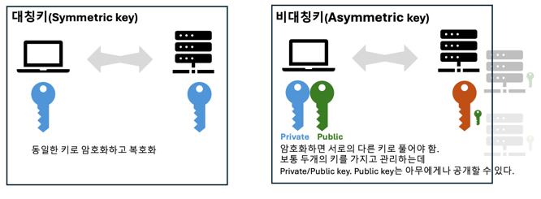
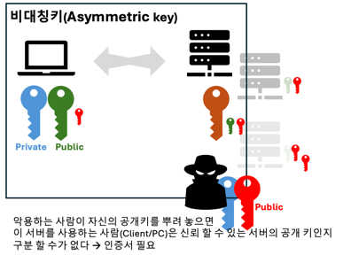
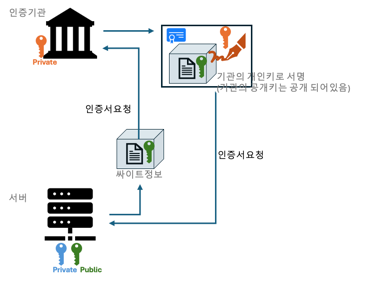
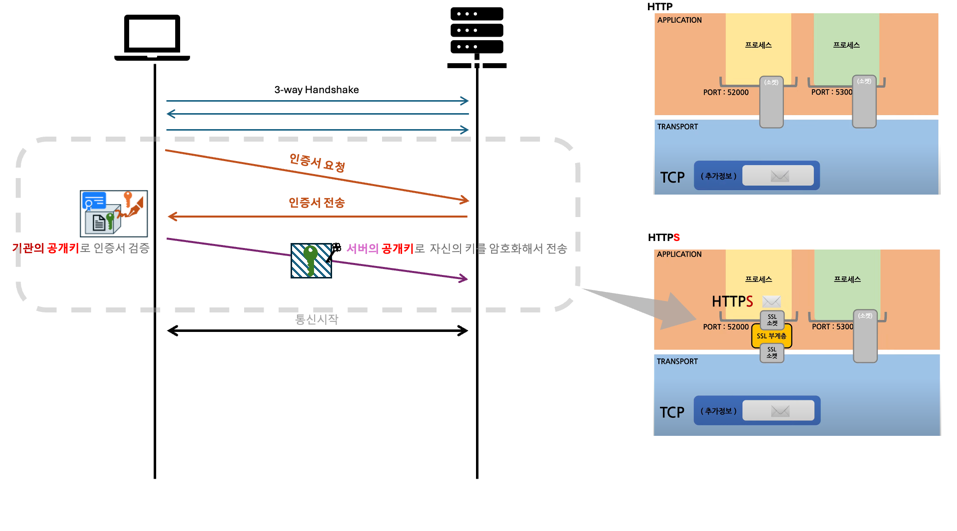

## 대칭키(Symmetric key)알고리즘 과 비대칭키(Asysmmetric key)알고리즘

우선 암호와에대한 이해를 위해서 대칭키(Symmetric key)알고리즘 과 비대칭키(Asysmmetric key)알고리즘에 대해서 알아볼 필요가 있다.

---
### 대칭키(Symmetric key)알고리즘
대칭키(Symmetric Key) 암호화란 **"하나의 키"** 로 암호화와 복호화를 모두 수행하는 것을 말한다. 이러한 대칭키 암호 알고리즘은 다양한 종류가 있다.
		
	• 암호화는 다음과 같은 종류가 있다.
		○ DES(Data Encryption Standard)는 대칭 키 암호 중 하나인 64-비트 블록 암호이며 56-비트 비밀키를 사용한다.
		○ AES(Advanced Encryption Standard)는 미국 표준 블록 암호였던 DES의 안전성 문제가 제기됨에 따라 2000년 미국 표준 블록암호로 채택된 128-비트 블록암호입.
		○ 아리아(ARIA)는 전자상거래, 금융, 무선통신 등에서 전송되는 개인정보와 같은 중요한 정보를 보호하기 위해 1999년 2월 한국인터넷진흥원과 한국의 암호 전문가들이 순수 한국 기술로 개발한 128-비트 블록암호.
		○ 시드(SEED)는 전자상거래, 금융, 무선통신 등에서 전송되는 개인정보와 같은 중요한 정보를 보호하기 위해 1999년 2월 한국인터넷진흥원과 한국의 암호 전문가들이 순수 한국 기술로 개발한 128-비트 블록암호.

대칭키 암호화는 양방향 암호화로써, 복호화가 가능한 암호 알고리즘. 암호화와 복호화에 쓰이는 키 크기가 상대적으로 작고 암호 알고리즘 내부 구조가 단순하여, 시스템 개발 환경에 용이하고, 비대칭키에 비해 암호화와 복호화 속도가 빠르다. 

하지만 교환 당사자간에 동일한 키를 공유해야 하기 때문에 키관리의 어려움이 있고, 잦은 키 변경이 있는 경우에 불편함을 초래함. 뿐만 아니라 디지털 서명 기법에 적용이 곤란하고 안전성을 분석하기가 어렵고 중재자가 필요함. 또한 만일 이 키를 공유해야 하는 시스템이 많다면 그만큼 위험성은 끔찍하게 늘어난다.

### 비대칭키(Asymmetric key)알고리즘
비대칭키(Asymmetric Key) 암호화는 다른 말로 공개키 암호 알고리즘라고 알려져 있다. 이는 **하나의 키가 아닌 "암호화에 쓰이는 키 값과 복호화에 쓰이는 키 값이 다른"** 것을 의미한다.

	• 비대칭 키의 종류는 다음과 같이 있다.
        ○ RSA(Rivest, Shamir and Adleman)은 대표적인 공개키 암호 알고리즘이다. RSA는 공개키 암호 시스템으로 암호화와 인증에 사용되고, RSA는 오늘날 사용되는 공개키 암호 방식의 가장 일반적인 공개 알고리즘이다.
        ○ ElGamal 이산 대수 문제의 어려움에 기반을 둔 최초의 공개키 암호 알고리즘인 ElGamal은 1984년 스탠퍼드 대학의 암호 학자 T. ElGamal에 의해 제안되었다.
        ○ ECC(Elliptic Curve Cryptosystem)타원곡선(Elliptic Curve)은 약 150년 전부터 수학적으로 광범위한 연구가 있었다. 이러한 수학적 원리를 이용하여 차세대 공개키 암호 방법으로 주목 받고 있다.
        ○ DSA(SEED)는 전자상거래, 금융, 무선통신 등에서 전송되는 개인정보와 같은 중요한 정보를 보호하기 위해 1999년 2월 한국인터넷진흥원과 한국의 암호 전문가들이 순수 한국 기술로 개발한 128-비트 블록암호이다.

비대칭키 암호화는 **양방향 암호화**로써, 복호화가 가능한 암호 알고리즘이다. 공개키 암호는 대칭키 암호의 키 전달에 있어서 취약점을 해결하고자 한 노력의 결과로 탄생했음. 한 쌍의 키가 존재하며, 하나는 특정 사람만이 가지는 개인키(또는 비밀키)이고 다른 하나는 누구나 가질 수 있는 공개키이다. 
공개키 암호화 방식은 암호학적으로 연관된 두 개의 키를 만들어서 하나는 자기가 안전하게 보관하고 다른 하나는 상대방에게 공개한다. 
개인키로 암호화 한 정보는 그 쌍이 되는 공개키로만 복호화가 가능하고, 공개키로 암호화한 정보는 그 쌍이 되는 개인키로만 복호화가 가능하다.
          
### 그리고 인증서
만약, 개인이 비밀통신을 할 경우 비대칭키 암호화보다 대칭키 암호를 사용할 수 있지만, 다수가 통신을 할 때에는 키의 개수가 급증하게 되어 큰 어려움이 따른다. 
이런 어려움을 극복하기 위해 나타난 것이 공개키 암호이다. 공개키 암호는 다른 유저와 키를 공유하지 않더라도 암호를 통한 안전한 통신을 할 수 있다는 장점을 있다.

하지만, 사칭하는 사람이 공개키를 여기저기 뿌려놓으면 이것을 사용하는 클라이언트(PC)는 올바른(의도한)서버의 공개키인지 구분할수 있는 방법이 없다.
그러면, 클라언트는 중요정보를 사칭하는 서버에 보낼수가 있다. 그래서 인증서가 필요하게되었다.

HTTPS통신에서는 3-way handshake단계를 거치면 아래와 같이 Welcome Port에 의해 각각요청에대해서 추가적인 포트에 프로세스를 생성하여 할당하여(Receiver에서는 동일한 요청이 중복되지 않도록 요청된 패킷의 정보를 활용하여 관리한다) SSL통신을 준비한다.

